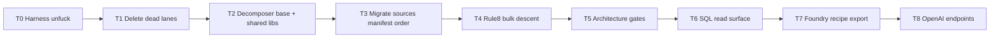

# Full-stack remediation (end-to-end fix work)

## Binding truth (this chat session — not negotiable)

- **Invention arc** (code + 01/05/08/09/12): content-addressed substrate → Glicko consensus → **SQL graph serving** (`laplace.recall`, `recall_session`, native `define_fast`) with **no GPU on the live request path** → **user-tailored `laplace.recipe` → deterministic GGUF export** (CPU/MKL synthesis; users run GGUF on their GPU elsewhere) → optional reverse ingest via `ModelDecomposer`.
- **Audit ([17](.scratchpad/17_Decomposer_Full_Stack_Audit.md))** is evidence input, **not** the finish line.
- **Doc 18** is the remediation ledger — it **precedes** this Cursor plan as the work spec; it is **updated as fixes land**, not produced as a gate before fixes start.
- **Contaminated** (never cite as authority): [doc 13](.scratchpad/13_Stabilization_Audit_and_Plan.txt), `next-task.prompt` pipeline chain, compacted [02](.scratchpad/02_Identified_Issues.txt) status index alone, CLAUDE.md 2026-07-05 rewrite framing doc 13 as law.
- **Trust**: running code first; author docs 05, 06, 08, 09, 11, 12, 01; ops [witness-manifest.json](scripts/win/witness-manifest.json), [decomposer-gates.json](scripts/decomposer-gates.json).
- **Agent owns delivery** — no re-prompting, no "say go", no shrinking scope to decomposer-only.

---

## What "done" means

| Area | Done when |
|------|-----------|
| **Harness** | Agents read code + 05/06/09 first; doc 13 archived/bannered; CLAUDE doc map + [.cursor/rules/laplace-law.mdc](.cursor/rules/laplace-law.mdc) fixed |
| **Dead lanes** | `OMWEtlRegistration`, `WiktionaryEtlRegistration`, `PCoreParallelCompose`, orphan `NativeGrammarIngest`, dead native ETL paths **deleted** |
| **Decomposers** | All 34 on `Decomposer<T>` extract-only → `IngestBatchPipeline`; hand builders gone except documented Unicode tier-0 seed exception; shared extractors for dup clusters |
| **Rule #8** | One O(tiers) bulk descent per working set (06 L93–94); Tabular calculated layer split from witness path |
| **Gates** | `DecomposerArchitectureGateTests` covers Chess; bans hand `SubstrateChangeBuilder` in `DecomposeAsync` |
| **SQL/read** | Read [SubstrateClient.cs](app/Laplace.Endpoints.OpenAICompat/SubstrateClient.cs), [define_fast.sql.in](extension/laplace_substrate/sql/functions/lexical/define_fast.sql.in), `recall.c`; close 07 P2 fragmentation where audit finds dupes |
| **Foundry/export** | Read [RecipeDescriptor.cs](app/Laplace.Decomposers/Model/RecipeDescriptor.cs), [FoundryCommands.cs](app/Laplace.Cli/FoundryCommands.cs), [engine/synthesis](engine/synthesis); fix export path bugs found in audit |
| **Endpoints** | OpenAI-compat routes consistent with SQL recall serving + recipe compile/export services |
| **Verify ritual** | Per tranche: `test-app.cmd` → `SourceIdPinTests` → isolated DB → `cmd /c scripts\win\seed-step.cmd <source>` → `:verify_step` → 0 novel rows |

---

## Execution order (this IS the plan — not "write a plan")

### T0 — Harness unfuck (immediate)

- Fix [CLAUDE.md](CLAUDE.md) doc map: invention = 09/05/01; 17 = audit evidence; 13 = historical/agent draft with banner
- Fix [.cursor/rules/laplace-law.mdc](.cursor/rules/laplace-law.mdc) if it points agents at doc 13 as active plan
- Banner/archive [doc 13](.scratchpad/13_Stabilization_Audit_and_Plan.txt)
- Complete partial fix of [AGENTS.md](AGENTS.md) + [next-task.prompt.md](.github/prompts/next-task.prompt.md)

**Verify:** grep harness for doc 13 as "start here" / "active plan"

### T1 — Delete dead code (zero behavior change)

From [17 §5](.scratchpad/17_Decomposer_Full_Stack_Audit.md):

- Delete [`OMWEtlRegistration.cs`](app/Laplace.Decomposers/OMW/OMWEtlRegistration.cs), [`WiktionaryEtlRegistration.cs`](app/Laplace.Decomposers/Wiktionary/WiktionaryEtlRegistration.cs)
- Delete [`PCoreParallelCompose.cs`](app/Laplace.Substrate/Abstractions/PCoreParallelCompose.cs) + tests (no production callers — doc 13 claim disproved)
- Remove unreachable `NativeGrammarIngest` CLI paths
- Evaluate/delete [`etl_witness_conceptnet.c`](engine/core/src/etl_witness_conceptnet.c) vs live ConceptNet decomposer

**Verify:** `cmd /c scripts\win\test-app.cmd` + `DecomposerArchitectureGateTests`

### T2 — Spine unification primitives

Before per-source migration:

- Add `Decomposer<TRecord>` (extend [`RelationTripleDecomposerBase`](app/Laplace.Decomposers/ConceptNet/RelationTripleDecomposerBase.cs) pattern)
- Shared modules from 17 §6: `ParquetRecordStream`, `XmlFramesetRecordExtractor`, FrameNet lemma helpers, underscored UTF-8 canonicalize, tab bridge parser
- Fold `ContentWitnessBatch` callers → [`ContentTierSpine`](app/Laplace.Substrate/Abstractions/ContentTierSpine.cs) direct

**Verify:** architecture gate; no new hand builders

### T3 — Migrate every decomposer ([witness-manifest.json](scripts/win/witness-manifest.json) order)

Priority from [17 §4](.scratchpad/17_Decomposer_Full_Stack_Audit.md):

1. **Near-target first:** ConceptNet, Atomic2020, OpenSubtitles, Document, MapNet, WordFrameNet, UD, Code/Stack/TinyCodes, OMW
2. **Hand-roll heavy:** Unicode (tier-0 seed exception only), Tabular (split calculated), WordNet, PropBank/VerbNet, FrameNet, SemLink, Model, ChessOpenings, ChessPgn

Per source: inherit `Decomposer<T>`, delete hand `DecomposeAsync`, run verify ritual.

Finish [17 §6](.scratchpad/17_Decomposer_Full_Stack_Audit.md) cross-stack map **while migrating** (read `content_witness_batch.c`, `descent_probe.c`, etc. — not grep names).

### T4 — Rule #8 step 5 completion

Implement cross-working-set O(tiers) bulk descent once ([06 Rule #8](.scratchpad/06_Engineering_Ruleset.txt) L93–94) — blocked until T3 gives one handler door.

### T5 — Harden gates

Extend [`DecomposerArchitectureGateTests.cs`](app/Laplace.Substrate.Tests/Abstractions/DecomposerArchitectureGateTests.cs): include Chess; require `Decomposer<T>` or Unicode allowlist; ban `new SubstrateChangeBuilder` in `DecomposeAsync`.

### T6 — SQL / read surface

Read and fix (not inventory):

- [`SubstrateClient.cs`](app/Laplace.Endpoints.OpenAICompat/SubstrateClient.cs) → `laplace.recall`
- [`define_fast.sql.in`](extension/laplace_substrate/sql/functions/lexical/define_fast.sql.in) + [`recall.c`](extension/laplace_substrate/src/recall.c)
- [`QueryCommands.cs`](app/Laplace.Cli/QueryCommands.cs) parallel read path
- Reconcile with [07](.scratchpad/07_SQL_Surface_Audit.txt) P2 gaps; Rule #6 dupes

### T7 — Foundry / recipe / GGUF export

Read and fix:

- [`RecipeDescriptor.cs`](app/Laplace.Decomposers/Model/RecipeDescriptor.cs) — user tailoring surface
- [`FoundryCommands.cs`](app/Laplace.Cli/FoundryCommands.cs) `SynthesizeMoldAModelAsync`
- [`engine/synthesis`](engine/synthesis) including `gguf_writer.cpp`
- [`ModelDecomposer.cs`](app/Laplace.Decomposers/Model/ModelDecomposer.cs) reverse path

**Verify:** foundry-loop skill ritual (synthesize → export → knowledge verdict)

### T8 — OpenAI endpoints

- [`Laplace.Endpoints.OpenAICompat`](app/Laplace.Endpoints.OpenAICompat): recall_session, billing/quotes, recipe export compile
- Ensure serving path stays SQL-native (no GGUF on request path)

---

## Doc 18 role (not a deliverable gate)

[`.scratchpad/18_Remediation_Plan.md`](.scratchpad/18_Remediation_Plan.md) is the **living remediation ledger**: updated **in parallel** as each tranche completes (checkbox + verify proof per item). It does **not** block T0–T8. This Cursor plan **is** the execution sequence; doc 18 records what landed.

---

## What this plan explicitly rejects

- Treating audit completion as "done"
- "Write doc 18 then wait" as a phase
- doc 13 / pipeline chain as invention law
- Decomposer-only scope ignoring SQL, foundry, endpoints
- File-list grep pretending to be code review
- Putting next steps back on the user
