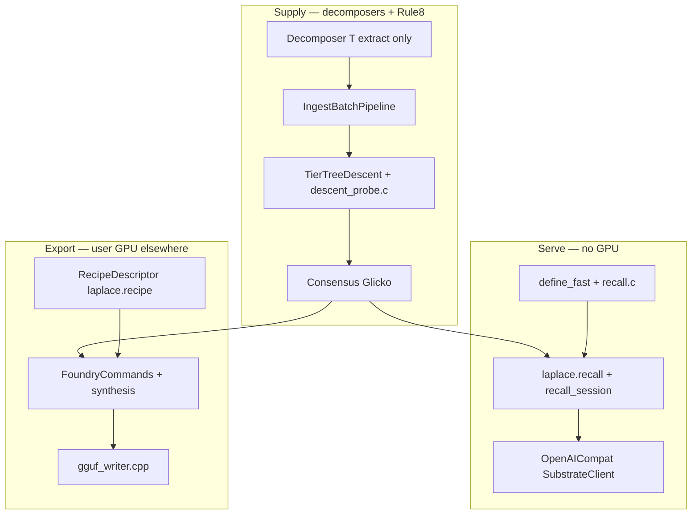

# Full-stack remediation

## Self-audit — why the prior plan was garbage

| Flaw | What was wrong |
|------|----------------|
| **Circular emptiness** | [17 §6](.scratchpad/17_Decomposer_Full_Stack_Audit.md) said "see plan §6"; plan said "finish 17 §6 during migration". Neither had file:line dupes. |
| **Product last** | T6–T8 (live SQL recall, user recipe→GGUF export, OpenAI API) sequenced **after** migrating 34 decomposers — repeats doc-13 "pipeline chain" thinking you rejected. |
| **Gates after migration** | T5 hardened gates **after** T3 migrated everything — backwards; gate must block new violations before bulk migration. |
| **One verify ritual** | `seed-step :verify_step` applies to **ingest** only; SQL/foundry/endpoints need different proofs (psql `senses(word_id('dog'))`, foundry-loop, endpoint smoke). |
| **Missing [doc 16](.scratchpad/16_tier_correct_attestation_and_hub_unification.md)** | Author spec from 2026-07-06 with concrete P1–P7 fixes + validation results — completely absent. Real bugs (UD per-token HAS_LANGUAGE) not in plan. |
| **Doc 18 contradiction** | Said doc 18 "precedes" plan while also listing "update doc 18" as a todo; file does not exist. Session instructions + this plan **are** the spec. |
| **T3 blob** | "Migrate all 34" with no row checklist — unexecutable. [17 §4](.scratchpad/17_Decomposer_Full_Stack_Audit.md) table exists; plan ignored it. |
| **T6–T8 placeholders** | "Read and fix" with no findings — exactly the name-dropping you called out. |
| **Harness unfixed in repo** | [.cursor/rules/laplace-law.mdc](.cursor/rules/laplace-law.mdc) L21 still: "`13` is the active plan" — plan said "if it points" instead of citing the live violation. |
| **Two plan files** | 441-line `decomposer_audit_deliverable_*.plan.md` vs 175-line replacement — disjointed artifacts, not one truth. |

This rewrite fixes ordering, merges 16+17, drops doc-18-as-work, and makes every phase executable with concrete files and verify steps.

---

## Binding law (this chat session)

- **Full invention:** CONTENT / EVIDENCE / CONSENSUS substrate → **SQL graph serving** (no GPU on request path) → **user `laplace.recipe` → GGUF export** (CPU/MKL; GPU is user's runtime) → reverse `ModelDecomposer`.
- **Contaminated:** doc 13, next-task pipeline chain, compacted 02 index alone, CLAUDE 2026-07-05 rewrite elevating 13.
- **Trust:** code; 05, 06, 08, 09, 11, 12, 01, **16**; witness-manifest + decomposer-gates for ingest order only.
- **Agent owns execution** — no re-prompting, no audit-as-deliverable, no "write doc 18 first".

---

## Architecture (one picture)

Remediation touches **all three subgraphs**, not just supply.

---

## Execution phases

### P0 — Harness unfuck (blocks agent sabotage loop)

| File | Fix |
|------|-----|
| [.cursor/rules/laplace-law.mdc](.cursor/rules/laplace-law.mdc) L21 | Remove "`13` is the active plan" → point to 05/06 + code |
| [CLAUDE.md](CLAUDE.md) doc map | 09/05/01 = invention; 16 = tier attestation; 17 = audit evidence; 13 = historical banner |
| [doc 13](.scratchpad/13_Stabilization_Audit_and_Plan.txt) | Banner: agent draft 2026-07-05 — verify against code |
| [AGENTS.md](AGENTS.md), [next-task.prompt.md](.github/prompts/next-task.prompt.md) | Finish demotion of 13 (partial done) |

**Verify:** `rg "13.*active plan|start here.*13" .cursor CLAUDE.md AGENTS.md .github`

---

### P1 — Delete dead lanes ([17 §5](.scratchpad/17_Decomposer_Full_Stack_Audit.md))

- Delete [`OMWEtlRegistration.cs`](app/Laplace.Decomposers/OMW/OMWEtlRegistration.cs), [`WiktionaryEtlRegistration.cs`](app/Laplace.Decomposers/Wiktionary/WiktionaryEtlRegistration.cs)
- Delete [`PCoreParallelCompose.cs`](app/Laplace.Substrate/Abstractions/PCoreParallelCompose.cs) + tests (zero production callers)
- Remove unreachable [`NativeGrammarIngest`](app/Laplace.Substrate/Abstractions/NativeGrammarIngest.cs) CLI paths ([`EtlDecomposer`](app/Laplace.Decomposers/Etl/EtlDecomposer.cs) L90–92 fallback only)
- Evaluate delete [`etl_witness_conceptnet.c`](engine/core/src/etl_witness_conceptnet.c) vs live ConceptNet triple base

**Verify:** `cmd /c scripts\win\test-app.cmd` + `DecomposerArchitectureGateTests`

---

### P2 — Spine primitives + gates (before any source migration)

**Build:**

- `Decomposer<TRecord>` extending [`RelationTripleDecomposerBase`](app/Laplace.Decomposers/ConceptNet/RelationTripleDecomposerBase.cs)
- Shared extractors (Rule #6): parquet stream (Stack/TinyCodes), XML frameset (PropBank/VerbNet), FrameNet lemma helpers, underscored UTF-8 canonicalize, tab bridges
- `ContentWitnessBatch` callers → [`ContentTierSpine`](app/Laplace.Substrate/Abstractions/ContentTierSpine.cs) direct

**Gate now** ([`DecomposerArchitectureGateTests.cs`](app/Laplace.Substrate.Tests/Abstractions/DecomposerArchitectureGateTests.cs)):

- Include `Laplace.Chess` decomposers
- Require `Decomposer<T>` or Unicode tier-0 allowlist
- Ban `new SubstrateChangeBuilder` inside `DecomposeAsync`

**Verify:** gate tests pass before P4 starts

---

### P3 — Tier-correct attestation ([doc 16](.scratchpad/16_tier_correct_attestation_and_hub_unification.md) §7)

| Item | Status | Work |
|------|--------|------|
| P7 SEMANTIC_EQUIVALENCE | Done (16 §8) | — |
| P3 PredicateMatrix source | Done (16 §8) | — |
| P1 Tatoeba translation anchor | Unit test pass | Scale validation on reseed |
| **P2 UD HAS_LANGUAGE at sentence tier** | **Pending live** | [`UdSentenceEmitter.cs`](app/Laplace.Decomposers/UD/UdSentenceEmitter.cs) — stop per-token L84–85, L142–147 |
| P4 ConceptNet `/wn/` + POS | Pending | ConceptNet extract |
| P5 UD XPOS → IS_A UPOS + FEAT_* | Pending | UD emitter |
| P6 Wiktionary → synset hub | Pending | Wiktionary grammar ingest |

**Verify:** doc 16 §8 probes after affected `seed-step`; `senses(word_id('dog')) > 0` (not `senses('dog')` — 16 §8 landmine)

---

### P4 — Per-source decomposer migration ([17 §4](.scratchpad/17_Decomposer_Full_Stack_Audit.md) — every row)

Order: [`witness-manifest.json`](scripts/win/witness-manifest.json) `cadence_law` / [`decomposer-gates.json`](scripts/decomposer-gates.json) `manifest_order`.

**Near-target (prove base first):** conceptnet, atomic2020, opensubtitles, document, mapnet, wordframenet, ud, code, stack, tiny-codes, omw

**Must fix (hand-roll / 08 violations):**

| Source | File | Issue |
|--------|------|-------|
| unicode | [`UnicodeDecomposer.cs`](app/Laplace.Decomposers/Unicode/UnicodeDecomposer.cs) L66–535 | Hand builder — **only** tier-0 seed exception |
| tabular | [`TabularDecomposer.cs`](app/Laplace.Decomposers/Code/TabularDecomposer.cs) L58–133 | RAM aggregation — split calculated layer (08) |
| wordnet | [`WordNetDecomposer.cs`](app/Laplace.Decomposers/WordNet/WordNetDecomposer.cs) | ContentWitnessBatch shim |
| propbank/verbnet | L61+ / L52+ | Duplicate XML compose ~130 LOC each |
| framenet | L360–491 | LemmaOf dup with LuIngest |
| semlink | orchestrator L36–101 | 4 sub-ingests |
| chess-openings | [`ChessOpeningsDecomposer.cs`](app/Laplace.Chess/Service/ChessOpeningsDecomposer.cs) L31–71 | Full hand builder |
| chess-pgn | [`ChessPgnDecomposer.cs`](app/Laplace.Chess/Service/ChessPgnDecomposer.cs) L71+L77 | Dual pipeline lanes |
| model | 6× DecomposerBatch phases | Model + TokenEdgeETL |

**Per source verify:** `SourceIdPinTests` → isolated DB → `cmd /c scripts\win\seed-step.cmd <source>` → `:verify_step` → 0 novel rows

**Cross-stack Rule #6 (fill 17 §6 during P4 — canonical / violators):**

| Fact | Canonical | Violators |
|------|-----------|-----------|
| Tier compose | `ContentTierSpine`, `text_decomposer.c`, `hash_composer.c` | Unicode hand path, ChessOpenings |
| Witness batch | `content_witness_batch.c` | C# `ContentWitnessBatch`, `etl_witness_conceptnet.c` |
| Existence | `TierTreeDescent`, `descent_probe.c` | Legacy flat probes |
| Glicko | `ConsensusAccumulatingWriter`, `glicko2.c` | Retired server fold |
| Highway mask | `HighwayPerfcache`, `highway_table.c` | Inline mask construction |
| Grammar | `grammar_compose.cpp` | Whole-file load bypassing handler |
| Read/recall | `define_fast`, `recall.c` | CTE-blocked SQL chains (07 P2) |

---

### P5 — Rule #8 step 5 bulk descent

One cross-working-set O(tiers) descent ([06](.scratchpad/06_Engineering_Ruleset.txt) L93–94) after P4 gives single handler door.

**Verify:** ingest perf + correctness on multi-document working set; no per-document probe explosion

---

### P6 — SQL read surface (product — not ingest)

**Read these files end-to-end before claiming fixes:**

- [`SubstrateClient.cs`](app/Laplace.Endpoints.OpenAICompat/SubstrateClient.cs) L51–54 — `laplace.recall(@p, resolve_topic(@prior))` — **no GGUF, no GPU**
- [`define_fast.sql.in`](extension/laplace_substrate/sql/functions/lexical/define_fast.sql.in) + [`recall.c`](extension/laplace_substrate/src/recall.c)
- [`QueryCommands.cs`](app/Laplace.Cli/QueryCommands.cs) — parallel CLI read path
- [07](.scratchpad/07_SQL_Surface_Audit.txt) P2 — duplicate NOT-refuted predicates, fragmented read helpers

**Verify:** `psql` → `SET search_path=laplace,public;` → `SELECT senses(word_id('dog'));` → `SELECT * FROM api('recall');` — latency + correctness

---

### P7 — Foundry / user-tailored GGUF export

**Read end-to-end:**

- [`RecipeDescriptor.cs`](app/Laplace.Decomposers/Model/RecipeDescriptor.cs) — `kind: laplace.recipe`, layers, heads, operators, vocab seeds
- [`FoundryCommands.cs`](app/Laplace.Cli/FoundryCommands.cs) — `SynthesizeMoldAModelAsync` (CPU/MKL)
- [`engine/synthesis/`](engine/synthesis) — `gguf_writer.cpp`, weight construction from consensus
- [`ModelDecomposer.cs`](app/Laplace.Decomposers/Model/ModelDecomposer.cs) — reverse ingest

**Verify:** foundry-loop skill — synthesize → export GGUF → knowledge verdict (not token-only)

---

### P8 — OpenAI endpoints

- [`Laplace.Endpoints.OpenAICompat`](app/Laplace.Endpoints.OpenAICompat) — `recall_session`, billing/quotes, recipe compile/export routes
- Confirm chat path = P6 SQL recall only; export path = P7 foundry; **never load GGUF on request path**

**Verify:** endpoint integration smoke; billing quote round-trip if wired

---

## Definition of done

All P0–P8 complete with verify proof recorded in [17](.scratchpad/17_Decomposer_Full_Stack_Audit.md) §8 checklist (update rows as landed). No separate "doc 18" gate. Harness no longer injects doc 13. One spine, one fact per implementation, full product arc intact.

## Explicitly rejected

- Audit or plan doc as finish line
- Product surfaces deferred until all decomposers migrated
- Gates after migration
- Grep file lists without reading cited lines
- Putting next action on you
