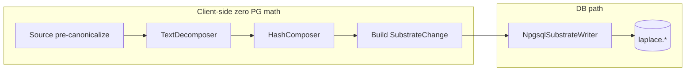
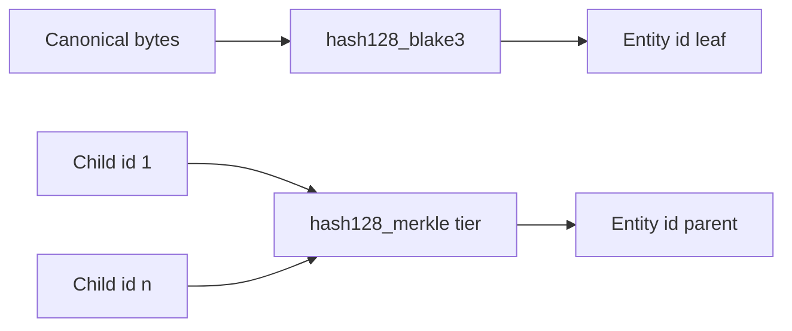
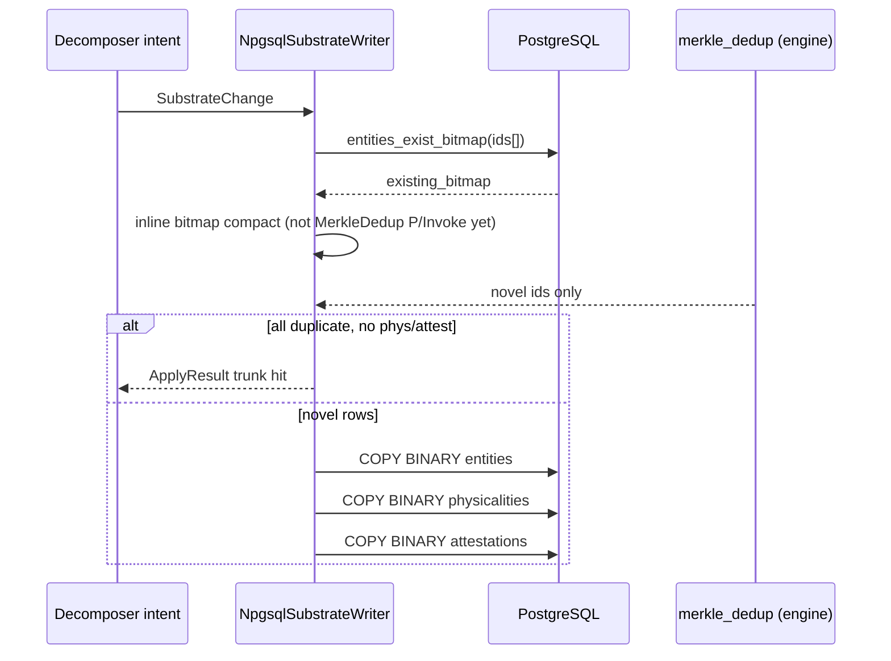
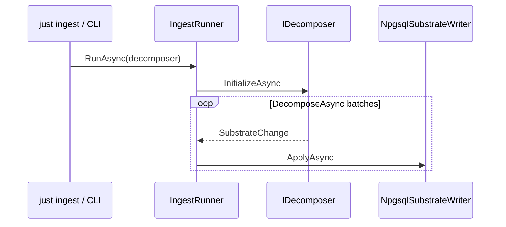
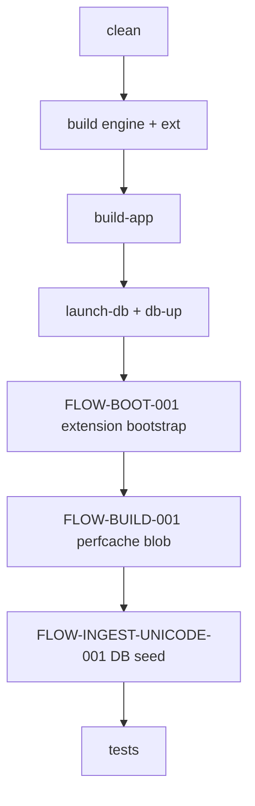
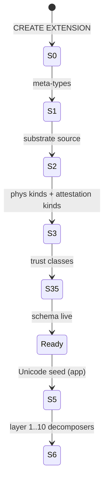
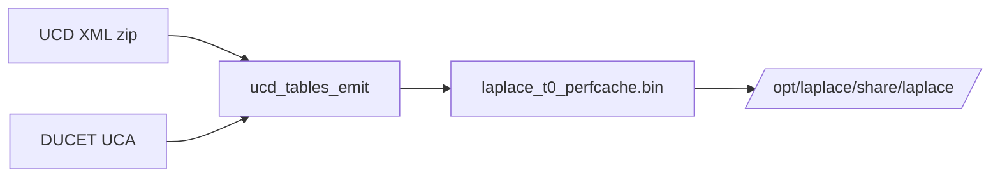
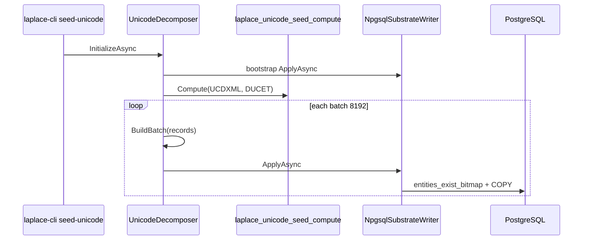
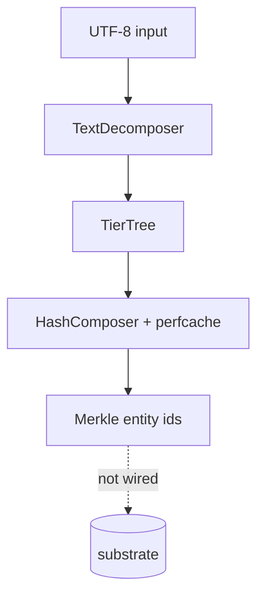
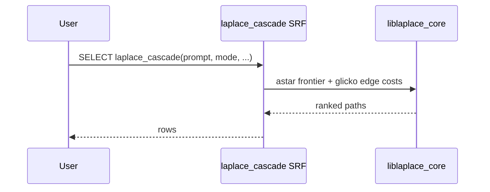

# FLOWS.md — Logical flow catalog

**Purpose:** Catalog every end-to-end and cross-cutting flow in Laplace from tip to tail. Each flow is a **separate swimlane**; shared mechanics live under [Cross-cutting primitives](#cross-cutting-primitives) and are **referenced**, not duplicated.

**Evidence policy (read this first):** A step is only marked `IMPLEMENTED` when a file in this repo implements it. Flow *shape* comes from user docs + ADRs; *wiring* comes from `Justfile`, `app/`, `engine/`, `extension/`. If this file disagrees with code, **code wins** — file an issue to fix the doc.

**Second pass (2026-05-25):** Ingest/write flows below are anchored to ADRs [0047](docs/adr/0047-text-decomposer-pure-primitive.md)–[0053](docs/adr/0053-perfcache-compile-time-build-pipeline.md), `extension/laplace_substrate/sql/laplace_substrate.sql.in` load order, `engine/core/CMakeLists.txt` source list, and `app/Laplace.*` projects. GitHub issue bodies were not fetched (offline); issue IDs are taken from **in-repo comments** only.

**Diagrams:** [Mermaid](https://mermaid.js.org/) (renders in GitHub, Cursor, many Markdown viewers). Covers UML-style **sequence**, **activity** (flowchart), and **state** diagrams — no separate Visio file required.

**Status legend:**

| Tag | Meaning |
|-----|---------|
| `IMPLEMENTED` | Runnable in repo today (may lack `just` wiring) |
| `PARTIAL` | Core path exists; missing pieces called out |
| `PLANNED` | Specified in DESIGN / ADRs; no runnable path |
| `BROKEN` | Documented entry point fails (missing script / CLI subcommand) |

**Authoritative specs:** [DESIGN.md](DESIGN.md) §IX (three-phase model), [OPERATIONS.md](OPERATIONS.md), [GLOSSARY.md](GLOSSARY.md), ADRs linked per flow.

---

## How to read this document

1. **Flow ID** — stable handle (`FLOW-INGEST-UNICODE-001`). Use in issues/ADRs.
2. **Prerequisites** — which flows must complete first (layer order per ADR 0037).
3. **Steps** — numbered, granular; **not** merged across flows even when code paths touch the same function.
4. **Code / gap** — file or symbol; `—` if not implemented.
5. **Diagram** — Mermaid for that flow only; primitives referenced by name.

**Merkle DAG rule:** Entity `id` = BLAKE3-128 of **canonical** content bytes at that tier. Parent `id` = `hash128_merkle(tier, [child ids…])`. Dedup is **not** “compare bytes in app” — it is **existence in `laplace.entities`** plus optional **trunk short-circuit** on re-ingest of known subtrees (ADR 0050).

---

## Canonical per-content-unit ingest pipeline (ADR 0047 → 0052)

Every text-bearing (or tier-tree-shaped) ingest unit follows **three directions** — do not collapse into one flow ID:

| Phase | Direction | Owner | Repo entry |
|-------|-----------|-------|------------|
| 1 — Decompose | Trunk → leaf (structure only) | `TextDecomposer` (+ per-source pre-canonicalization **before** this) | `engine/core/src/text_decomposer.c`, `app/Laplace.Engine.Core/TextDecomposer.cs` |
| 2 — Compose IDs | Leaf → trunk (hash, coord, Hilbert) | `HashComposer` | `engine/core/src/hash_composer.c`, `app/Laplace.Engine.Core/HashComposer.cs` |
| 3 — Dedup + insert | Trunk → leaf (DB membership) | `ISubstrateWriter.ApplyAsync` | `app/Laplace.SubstrateCRUD/Npgsql/NpgsqlSubstrateWriter.cs` |

Orchestration loop (checkpoint, layer gate, retry): `app/Laplace.Ingestion/IngestRunner.cs` per ADR 0052.

Intent shape between decomposer and writer: `app/Laplace.SubstrateCRUD/SubstrateChange.cs` per ADR 0049.

Plugin contract: `app/Laplace.Decomposers.Abstractions/IDecomposer.cs` per ADR 0051.

**Unicode T0 DB seed:** skips TextDecomposer/HashComposer — `UnicodeDecomposer` calls `laplace_unicode_seed_compute` on UCD/DUCET ([ADR 0006](docs/adr/0006-perfcache-and-db-seed-siblings.md) sibling of perf-cache; **does not** read the mmap blob to seed). **Text/corpus/prompt** paths use perf-cache only for **client-side T0 lookup** during `HashComposer`.

---

## Repository map (ingest / write path only)

| Project | Path | Role in flows |
|---------|------|----------------|
| `Laplace.Decomposers.Abstractions` | `app/Laplace.Decomposers.Abstractions/` | `IDecomposer`, `BootstrapIntentBuilder`, `DecomposerOptions` |
| `Laplace.Decomposers.Unicode` | `app/Laplace.Decomposers.Unicode/` | Only shipped decomposer (`UnicodeDecomposer`) |
| `Laplace.Engine.Core` | `app/Laplace.Engine.Core/` | P/Invoke: `TextDecomposer`, `HashComposer`, `MerkleDedup`, `CodepointPerfcache` |
| `Laplace.SubstrateCRUD` | `app/Laplace.SubstrateCRUD/` | `SubstrateChange`, `IntentStage`, `ISubstrateWriter` / `Reader` |
| `Laplace.Ingestion` | `app/Laplace.Ingestion/` | `IngestRunner`, `CheckpointJournal` |
| `Laplace.Cli` | `app/Laplace.Cli/Program.cs` | `seed-unicode`, `decompose`, `roundtrip` (text), `stats` — **no** `cascade` / `synthesize` / `ingest` |
| `laplace_substrate` extension | `extension/laplace_substrate/sql/` | Schema, bootstrap, Glicko aggregate, cascade stub, `entities_exist_bitmap` SRF |

### `laplace_substrate` SQL module load order

From `extension/laplace_substrate/sql/laplace_substrate.sql.in`:

| Order | Module | Flow relevance |
|-------|--------|----------------|
| 1 | `01_schema.sql.in` | `laplace` schema |
| 2 | `02_entities.sql.in` | `FLOW-XCUT-003` target table |
| 3 | `03_physicalities.sql.in` | same |
| 4 | `04_attestations.sql.in` | Glicko columns; UNIQUE dedup key |
| 5 | `05_indexes.sql.in` | cascade / lookup acceleration |
| 6 | `10_bootstrap.sql.in` | `FLOW-BOOT-001` stages 0–3.5 |
| 7 | `06_glicko2.sql.in` | `FLOW-QUERY-002` aggregate |
| 8 | `07_cascade.sql.in` | `FLOW-QUERY-001` — `laplace_astar_path` **commented out** |
| 9 | `08_sp_trajectory_ops.sql.in` | trajectory opclass (structural) |
| 10 | `09_brin_tier_ops.sql.in` | tier BRIN |
| 11 | `11_entities_exist_bitmap.sql.in` | `FLOW-XCUT-002` SRF |

### `liblaplace_core` translation units (`engine/core/CMakeLists.txt`)

| Source | Used in flows |
|--------|----------------|
| `hash128.c` | FLOW-XCUT-001 |
| `merkle_dedup.c` | FLOW-XCUT-002 (engine; writer not wired to P/Invoke) |
| `hash_composer.c` | FLOW-INGEST-TEXT-001 step 6 |
| `text_decomposer.c` + `normalize_nfc.c` + `grapheme_break.c` / `word_break.c` / `sentence_break.c` | FLOW-INGEST-TEXT-001 |
| `codepoint_table.c` | perf-cache mmap; T0 lookup |
| `intent_stage.c` | COPY BINARY materialization in writer |
| `glicko2.c` | FLOW-QUERY-002 math |
| `astar.c` | FLOW-QUERY-001 **stub** (`astar_open` returns NULL) |
| `tier_tree.c` | tier tree + trunk shortcircuit input |

Emit tool (not linked into `.so`): `engine/core/tools/ucd_tables_emit/` → target `laplace_ucd_tables_emit`; CMake custom command writes `laplace_t0_perfcache.bin` (`FLOW-BUILD-001`).

---

## Flow index

| ID | Name | Phase | Status |
|----|------|-------|--------|
| [FLOW-LIFECYCLE-000](#flow-lifecycle-000-greenfield-empty-start) | Greenfield empty start | Ops | PARTIAL (verify scripts still stub) |
| [FLOW-BOOT-000](#flow-boot-000-host-layer-01) | Host bootstrap (Layer 0–1) | Build | IMPLEMENTED |
| [FLOW-BOOT-001](#flow-boot-001-extension-install-bootstrap) | Extension install bootstrap (ADR 0042 §0–4) | Build | IMPLEMENTED |
| [FLOW-BUILD-001](#flow-build-001-t0-perf-cache-emit) | T0 perf-cache emit (sibling A) | Build | IMPLEMENTED |
| [FLOW-XCUT-001](#flow-xcut-001-hash128--merkle-parent-id) | hash128 + Merkle parent ID | Primitive | IMPLEMENTED |
| [FLOW-XCUT-002](#flow-xcut-002-merkle-dedup-on-write) | Merkle dedup on write | Primitive | PARTIAL |
| [FLOW-XCUT-003](#flow-xcut-003-substratecrud-apply) | SubstrateCRUD `ApplyAsync` | Primitive | IMPLEMENTED |
| [FLOW-XCUT-004](#flow-xcut-004-ingestrunner-orchestration) | IngestRunner orchestration | Ingest | IMPLEMENTED |
| [FLOW-INGEST-UNICODE-001](#flow-ingest-unicode-001-t0-db-seed) | Unicode T0 DB seed | Ingest | IMPLEMENTED |
| [FLOW-INGEST-TEXT-001](#flow-ingest-text-001-tier-tree-decomposition) | Text tier-tree decomposition | Ingest | PARTIAL |
| [FLOW-INGEST-TEXT-002](#flow-ingest-text-002-persist-text-corpus) | Persist text / corpus to substrate | Ingest | PLANNED |
| [FLOW-INGEST-PROMPT-001](#flow-ingest-prompt-001-prompt-as-ingestion) | Prompt as ingestion | Ingest | PLANNED |
| [FLOW-INGEST-CLI-001](#flow-ingest-cli-001-just-ingest-dispatch) | `just ingest` dispatch | Ingest | PARTIAL (unicode only) |
| [FLOW-INGEST-LAYER-010](#flow-ingest-layer-010-layered-seed-ladder) | Layered seed ladder (1–10) | Ingest | PLANNED |
| [FLOW-INGEST-MODEL-001](#flow-ingest-model-001-model-weight-etl) | Model weight-table streaming ETL ingest | Ingest | PLANNED |
| [FLOW-QUERY-001](#flow-query-001-compiled-cascade) | Compiled cascade inference | Query | PLANNED |
| [FLOW-QUERY-002](#flow-query-002-glicko-2-period-update) | Glicko-2 period update | Query | PARTIAL |
| [FLOW-SYNTH-001](#flow-synth-001-substrate-synthesis-export) | Substrate Synthesis export | Emit | PARTIAL |
| [FLOW-ROUNDTRIP-TEXT-001](#flow-roundtrip-text-001-text-file-byte-perfect-export-cli-only) | Text file byte-perfect export (CLI) | Emit | IMPLEMENTED |
| [FLOW-VERIFY-001](#flow-verify-001-determinism--perfcache-parity) | Determinism + perf-cache parity | Verify | PLANNED |

---

## Cross-cutting primitives

These are **not** user-facing flows. End-to-end flows **call into** them at specific steps.

### FLOW-XCUT-001: hash128 + Merkle parent ID

**Status:** IMPLEMENTED

| Step | Action | Code |
|------|--------|------|
| 1 | Canonicalize content bytes per entity type rule | Per decomposer / `TextDecomposer` policy |
| 2 | Leaf ID: `BLAKE3-128(canonical_bytes)` | `hash128_blake3` — `engine/core/src/hash128.c` |
| 3 | Internal node ID: `BLAKE3-128(tier ‖ child₁ ‖ … ‖ childₙ)` | `hash128_merkle` — same; P/Invoke `NativeInterop.Hash128Merkle` |
| 4 | Expose in SQL | `laplace_hash128_blake3`, `laplace_hash128_merkle` — `extension/laplace_geom/` |

---

### FLOW-XCUT-002: Merkle dedup on write

**Status:** PARTIAL — `filter_novel` wired; `trunk_shortcircuit` for tier trees in engine + tests, **not** yet in `NpgsqlSubstrateWriter` for tree-shaped intents.

| Step | Action | Code |
|------|--------|------|
| 1 | Collect candidate entity IDs for this intent | Decomposer / `HashComposer` output |
| 2 | **One** PG round-trip: packed existence bitmap | `laplace.entities_exist_bitmap` — `extension/laplace_substrate/src/laplace_substrate.c` |
| 3a | Flat list: compact to novel-only IDs | Engine: `merkle_dedup_filter_novel` in `engine/core/src/merkle_dedup.c`. **Writer today:** inline bitmap scan in `NpgsqlSubstrateWriter.ApplyAsync` (lines 67–74) — does **not** call `MerkleDedup.FilterNovel` yet (P/Invoke exists; covered by `MerkleDedupTests`). |
| 3b | Tier tree re-ingest: skip subtrees whose root already exists | `merkle_dedup_trunk_shortcircuit` — engine + tests only; **not** called from writer |
| 4 | If novel set empty **and** no phys/attest rows → return (0 COPY) | `NpgsqlSubstrateWriter` conservative trunk branch |
| 5 | Else COPY novel entities; physicalities/attestations COPY when present | `IntentStage` + Npgsql binary COPY — **no** `ON CONFLICT` on COPY path (see writer comment lines 191–194); re-seed with phys rows still issues COPY |

**Bitmap convention:** bit `i` set ⇔ `candidates[i]` already in `laplace.entities` (see `merkle_dedup.h`).

---

### FLOW-XCUT-003: SubstrateCRUD `ApplyAsync`

**Status:** IMPLEMENTED — see [FLOW-XCUT-002](#flow-xcut-002-merkle-dedup-on-write).  
**Gap:** Attestation UPSERT-no-op on duplicate observation key not proven on COPY path (DESIGN §I `attestations` UNIQUE).

---

### FLOW-XCUT-004: IngestRunner orchestration

**Status:** IMPLEMENTED — **not** wired to `just ingest` yet (ADR 0052 status: Proposed; code + `Laplace.Ingestion.Tests` exist).

| Step | Action | Code |
|------|--------|------|
| 1 | Enforce layer order: for `layer` in `0 .. decomposer.LayerOrder-1`, `HasSourceEverCompletedAsync(layer)` | `IngestRunner.cs` L59–67 — loop uses **0-based** layers per `IDecomposer.cs` L51–54 (ADR 0052 pseudocode uses 1-based; code differs) |
| 1b | Layer completion probe (MVP) | `NpgsqlSubstrateReader.HasSourceEverCompletedAsync` — probes `HasLayerCompleted/{layerOrder}` attestation; comment L21–26: full semantics land with decomposer story **#183** |
| 2 | `decomposer.InitializeAsync` (bootstrap intents) | Same |
| 3 | Open checkpoint journal (resume) | `CheckpointJournal.cs` |
| 4 | For each `SubstrateChange` from `DecomposeAsync` | Skip if `checkpoint.WasApplied(intent.Metadata.IntentId)` |
| 5 | Retry policy → `writer.ApplyAsync` | `ProcessOneIntentAsync` |
| 6 | Flush checkpoint; return `IngestRunResult` | Same |

**Note:** `laplace-cli seed-unicode` (`Program.cs` L49–77) calls `InitializeAsync` + `DecomposeAsync` + `ApplyAsync` **directly** — no `IngestRunner`, no checkpoint, no layer gate.

---

## Lifecycle & bootstrap

### FLOW-LIFECYCLE-000: Greenfield empty start

**Status:** PARTIAL — steps 1–8 and 10 work when PG + extensions are up; step 9 is **build-time** (`just build-perfcache`), not a runtime decomposer pass; `just verify*` scripts still stub.

**Intent:** From zero artifacts to a machine that can run Unicode tests and text decomposition demos.

| Step | Action | Entry | Status |
|------|--------|-------|--------|
| 1 | Clean build artifacts | `just clean` | IMPLEMENTED |
| 2 | Drop database (optional full reset) | `just db-nuke` | IMPLEMENTED |
| 3 | Rebuild C/C++ engine + extensions | `just build` | IMPLEMENTED |
| 4 | Rebuild C# / .NET app | `just build-app` | IMPLEMENTED |
| 5 | Recreate DB, roles, users | `just setup-host` / `just db-up` | IMPLEMENTED |
| 6 | Install extensions | `CREATE EXTENSION` via migrations | IMPLEMENTED |
| 7 | Substrate schema + install bootstrap rows | `laplace_substrate` SQL modules | IMPLEMENTED → [FLOW-BOOT-001](#flow-boot-001-extension-install-bootstrap) |
| 8 | T0 codepoint DB seed | `just seed-t0` → `dotnet run … Laplace.Cli seed-unicode` (needs `build-app` + live DB) | IMPLEMENTED |
| 9 | T0 perf-cache blob | **Working:** `just build-perfcache` (build/install, not runtime decomposer) | IMPLEMENTED → [FLOW-BUILD-001](#flow-build-001-t0-perf-cache-emit) |
| 10 | Tests: Unicode / UAX#29 / TextDecomposer | `just test`, `dotnet test`, `engine/core/tests/` | IMPLEMENTED |

---

### FLOW-BOOT-000: Host Layer 0–1

**Status:** IMPLEMENTED

| Step | Action | Code |
|------|--------|------|
| 1 | System account `laplace-runner`, peer auth | `scripts/bootstrap-laplace-runner.sh` |
| 2 | DbUp migrations: extensions, grants | `app/Laplace.Migrations/`, `db/migrations/` |
| 3 | Launch PG cluster | `just launch-db` |

**Prerequisite for:** all DB-backed flows.

---

### FLOW-BOOT-001: Extension install bootstrap

**Status:** IMPLEMENTED (Stages 0–3.5 + schema). Stage 4 full type vocabulary **deferred** to decomposers per ADR 0042.

**Trigger:** `CREATE EXTENSION laplace_substrate` (via `just db-up`).

| Stage | What gets inserted | Where |
|-------|-------------------|--------|
| 0 | Meta-types: `Type`, `Kind`, `PhysicalityKind`, `Source`, `SubstrateCanonical` | `extension/laplace_substrate/sql/10_bootstrap.sql.in` |
| 1 | Substrate-canonical `Source` entity | Same |
| 2 | `CONTENT` / `BUILDING_BLOCK` / `PROJECTION` enum entities | Same |
| 3 | Modality-agnostic attestation kinds + kind-value "tiers" [†] | Same |
| 3.5 | Ten `TrustClass_*` entities + priors [†] | Same |
| 4 | Universal types (`Text`, `Pixel`, `Codepoint`, …) | **PLANNED in SQL** — today `UnicodeDecomposer` registers `Codepoint` at init |
| 5 | T0 entities + phys | **Not in SQL** — [FLOW-INGEST-UNICODE-001](#flow-ingest-unicode-001-t0-db-seed) |

[†] **Anchor divergence (as-built, but contradicts [docs/SUBSTRATE-FOUNDATION.md](docs/SUBSTRATE-FOUNDATION.md) truth 5):** "kind-value tier" and `TrustClass_*` ladders are corruption — trust is a Glicko-2 value self-tuning from cross-source agreement, and "tier" is reserved exclusively for the Merkle stratum (T0 = Unicode codepoints). Rows are reported as what the bootstrap SQL currently inserts (mechanical fact), **not** as ratified design. See [Anchor divergences](#anchor-divergences-substrate-foundationmd).
| 6+ | Per-source decomposer layers | [FLOW-INGEST-LAYER-010](#flow-ingest-layer-010-layered-seed-ladder) |

---

### FLOW-BUILD-001: T0 perf-cache emit

**Status:** IMPLEMENTED — **sibling A** of DB seed (ADR 0006). Independent derivation from same UCD + UCA inputs.

| Step | Action | Code |
|------|--------|------|
| 1 | Read UCD XML (codepoint properties) | `engine/core/tools/ucd_tables_emit/` |
| 2 | Read DUCET / UCA (collation keys) | Same |
| 3 | For each codepoint `0..0x10FFFF`: UTF-8 bytes → entity hash | BLAKE3 in emit tool |
| 4 | Map collation rank → super-Fibonacci 4D coord + Hilbert index | Engine placement math |
| 5 | Write versioned binary blob + header CRC | `laplace_t0_perfcache_*.bin` |
| 6 | Install to `share/laplace/` | `engine/core/CMakeLists.txt` install rule |
| 7 | CMake: extract UCDXML zip → run `laplace_ucd_tables_emit --ucdxml --ducet --ucd-version --uca-version --output` | `engine/core/CMakeLists.txt` L79–102 |
| 8 | **Entry:** `just build-perfcache` → `cmake --build build --target laplace_t0_perfcache` | `Justfile` L133+ |
| 9 | Format contract | `engine/core/include/laplace/core/perfcache_format.h` (ADR 0053 amendment: magic `LPRF`, v2, 80-byte records) |

**Does not touch PostgreSQL.** Cross-check with DB seed: [FLOW-VERIFY-001](#flow-verify-001-determinism--perfcache-parity).

---

## Ingest flows

### FLOW-INGEST-CLI-001: `just ingest` dispatch

**Status:** PARTIAL — `unicode` only.

| Step | Action | Code |
|------|--------|------|
| 1 | `just ingest <source>` | `Justfile` → `scripts/ingest-source.sh` |
| 2 | `unicode` → `dotnet run … Laplace.Cli ingest unicode` | `ingest-source.sh`, `Program.cs` `IngestAsync` |
| 3 | `IngestRunner.RunAsync(UnicodeDecomposer)` | Checkpoint + retry; skips layer gate (`LayerOrder` 0) |
| 4 | Other sources | Shell exits 1 with planned message |

**Contrast:** `just seed-t0` / `seed-unicode` = same decomposer, **no** `IngestRunner` (faster path, no checkpoint journal).

---

### FLOW-INGEST-UNICODE-001: T0 DB seed

**Status:** IMPLEMENTED  
**Prerequisites:** [FLOW-BUILD-001](#flow-build-001-t0-perf-cache-emit), [FLOW-BOOT-001](#flow-boot-001-extension-install-bootstrap)  
**Layer:** ADR [0037](docs/adr/0037-layered-seed-ingestion-and-model-codec-fidelity.md) table lists this as **layer 1** (`UnicodeDecomposer`); code sets `LayerOrder => 0` in `UnicodeDecomposer.cs` — reconcile when tightening layer-order checks.  
**Decomposer:** `UnicodeDecomposer` — `app/Laplace.Decomposers.Unicode/UnicodeDecomposer.cs`

This flow is **flat** (1.11M sibling leaves, no parent Merkle nodes in the seed). Dedup uses [FLOW-XCUT-002](#flow-xcut-002-merkle-dedup-on-write) **filter_novel** only.

#### Phase A — Initialize (bootstrap vocabulary for this source)

| Step | Action | Code |
|------|--------|------|
| A1 | Build bootstrap `SubstrateChange`: register source entity | `BootstrapIntentBuilder(Source, …)` |
| A2 | Register `Codepoint` type entity (`type_id` → meta-`Type`) | `boot.AddType("Codepoint")` |
| A3 | Emit `HAS_TRUST_CLASS → StandardsDerived` for source | Bootstrap attestations in builder |
| A4 | `ApplyAsync` bootstrap intent | `IDecomposerContext.Writer` — one write |

#### Phase B — Stream codepoint batches (default 8192)

| Step | Action | Code |
|------|--------|------|
| B1 | `EnsureComputed`: `UnicodeSeed.Compute(ucdxml, ducet)` → `CodepointRecord[]` (same C function as perf-cache emit) | `UnicodeDecomposer.cs`, `unicode_seed.cpp` |
| B2 | `for start in 0..1_114_112 step batch` | `DecomposeAsync` |
| B3 | Entity: `id = r.Hash`, `tier = 0`, `type_id = CodepointType`, `first_observed_by = Source` | `BuildBatch` |
| B4 | Physicality: `CONTENT`, coords + Hilbert from record, `alignment_residual = 0` | `PhysicalityId.Compute` + `AddPhysicality` |
| B5 | `observed_at = 0` (timeless seed) | `PhysicalityRow` |
| B6 | Yield `SubstrateChange` (entities + phys, **zero** attestations in bounded seed) | `yield return` |
| B7 | Optional: [FLOW-XCUT-004](#flow-xcut-004-ingestrunner-orchestration) | `IngestRunner` / CLI `seed-unicode` |
| B8 | Per batch: [FLOW-XCUT-003](#flow-xcut-003-substratecrud-apply) | `NpgsqlSubstrateWriter` |

#### Phase C — Re-run behavior (idempotency)

| Step | Action | Code |
|------|--------|------|
| C1 | Second full seed: every entity id already in bitmap | All bits set → `novelEntities` empty |
| C2 | Physicalities still present per batch → **not** trunk-short-circuit; COPY physicalities again | **Gap:** idempotent re-seed not fully safe until COPY+`ON CONFLICT` or phys existence bitmap (ADR 0050) |

**Entry points:**

| Entry | Status |
|-------|--------|
| `laplace-cli seed-unicode` | IMPLEMENTED — `app/Laplace.Cli/Program.cs` |
| `just seed-t0` | `Justfile` → `dotnet run --project Laplace.Cli … seed-unicode` | IMPLEMENTED |
| `UnicodeSeedIntegrationTests` | IMPLEMENTED |

**Out of scope for this bounded seed (#183):** Unihan, emoji sequences, segmentation-class attestation cloud — layered on later decomposers.

---

### FLOW-INGEST-TEXT-001: Text tier-tree decomposition

**Status:** PARTIAL — **engine + CLI demo only**; does not persist to substrate.

**Prerequisites:** [FLOW-INGEST-UNICODE-001](#flow-ingest-unicode-001-t0-db-seed) (leaf codepoints must resolve via perf-cache for hash placement).

| Step | Action | Code |
|------|--------|------|
| 1 | Input UTF-8 text (file or string) | CLI `decompose` / tests |
| 2 | Decode UTF-8 → **observed** codepoints (**no** NFC/NFD at ingest — [ADR 0047](docs/adr/0047-text-decomposer-pure-primitive.md)) | `text_decomposer.c` |
| 3 | UAX#29 segmentation → grapheme/word/sentence/document tiers (GB/WB/SB from perf-cache flags) | `grapheme_break.c`, `word_break.c`, `sentence_break.c` |
| 4 | Build `TierTree` with parent indices (topological order) | `tier_tree` |
| 5 | Leaves: codepoint tier; link to T0 hash via perf-cache resolver | `HashComposer` + `CodepointPerfcache` |
| 6 | Internal nodes: [FLOW-XCUT-001](#flow-xcut-001-hash128--merkle-parent-id) bottom-up | `HashComposer.Run` |
| 7 | Assign 4D coords / Hilbert per tier policy | Engine composer |
| 8 | **Stop here today** — no `SubstrateChange`, no `ApplyAsync` | — |

**When persisted (FLOW-INGEST-TEXT-002):** step 9+ = materialize entities + `CO_OCCURS_WITH` / structural attestations + `merkle_dedup_trunk_shortcircuit` on the tree.

---

### FLOW-INGEST-TEXT-002: Persist text / corpus to substrate

**Status:** PLANNED — `just ingest text-corpus` → `scripts/ingest-source.sh` exits 1.

| Step | Action | Code |
|------|--------|------|
| 1–8 | Same as [FLOW-INGEST-TEXT-001](#flow-ingest-text-001-tier-tree-decomposition) | — |
| 9 | Build `SubstrateChange` per document (or shard) | `SubstrateChangeBuilder` (planned) |
| 10 | `merkle_dedup_trunk_shortcircuit` on tree | Engine + writer wiring |
| 11 | Emit `BUILDING_BLOCK` / `CONTENT` physicalities per source policy | Decomposer-specific |
| 12 | Emit corpus attestations (`CO_OCCURS_WITH`, tier bridges) | Attestation builder |
| 13 | [FLOW-XCUT-004](#flow-xcut-004-ingestrunner-orchestration) | — |

---

### FLOW-INGEST-PROMPT-001: Prompt as ingestion

**Status:** PLANNED (ADR 0035, DESIGN `laplace_cascade` preamble)

**Distinct from** corpus ingest: prompt-local observations must **not** promote user claims to global truth without policy + corroboration.

| Step | Action | Code |
|------|--------|------|
| 1 | Accept user prompt bytes | Endpoint / CLI |
| 2 | [FLOW-INGEST-TEXT-001](#flow-ingest-text-001-tier-tree-decomposition) on prompt | — |
| 3 | Dedup entities against existing substrate (reuse known codepoints/words) | FLOW-XCUT-002 |
| 4 | Create or reference **context entity** + trajectory | — |
| 5 | Record prompt-local attestations: `FOLLOWS`, `OCCURS_IN_CONTEXT`, order, session scope | Arena policy ADR 0036 |
| 6 | Do **not** promote prompt assertions to global truth; they stay session/source-scoped at low Glicko-2 effective-μ until corroborated by independent high-trust sources | as-built: `TrustClass_UserPromptContent` row [†] (anchor: trust is a self-tuning Glicko-2 value, not a class) |
| 7 | Hand off frontier root ids to [FLOW-QUERY-001](#flow-query-001-compiled-cascade) | — |

---

### FLOW-INGEST-LAYER-010: Layered seed ladder

**Status:** PLANNED (ADR 0037) — only **Layer 0 Unicode** exists as `Laplace.Decomposers.Unicode`.

| Layer | Source (planned) | Depends on |
|-------|------------------|------------|
| 0 | Unicode T0 | BOOT |
| 1 | ISO 639/3166/4217 | 0 |
| 2 | WordNet | 1 |
| 3 | OMW | 2 |
| 4 | UD | 1–3 |
| 5 | Wiktionary | 4 |
| 6 | Tatoeba | 5 |
| 7 | Atomic2020 + ConceptNet | 6 |
| 8 | Tree-sitter code | 0 + 1 |
| 9 | (reserved) | — |
| 10 | Model weight-table ETL ingest | 0–9 |

Each layer: own `IDecomposer` → [FLOW-XCUT-004](#flow-xcut-004-ingestrunner-orchestration) → domain bootstrap types/kinds at `InitializeAsync`.

---

### FLOW-INGEST-MODEL-001: Model weight-table streaming ETL ingest

**Status:** PLANNED (ADR 0037, v0.1 milestone)

**Anchor framing (per [docs/SUBSTRATE-FOUNDATION.md](docs/SUBSTRATE-FOUNDATION.md) truths 1–2, 6, 10):** Model ingest is a **streaming O(params) ETL of weight tables — never a recompute and never a "codec" round-trip.** Each weight tensor is a 2D lookup table flattened to a 1D float array; every cell is an *already-computed* relationship. Stream the tensor (oneTBB-parallel), emit significant cells as **Glicko-2 matchup observations** (weight = outcome; source-model trust = opponent strength); accumulate into consensus ratings; **store only the consensus, never the weight, never bit-perfect.** Must scale linearly to frontier models (Qwen3-480B, Llama4 Maverick, DeepSeek MoE, Flux). **Forbidden:** GEMM at ingest (`E·W·Wᵀ·Eᵀ` over vocab²), materializing a vocab² matchup space, or a flat top-k that discards most of the model.

| Step | Action | Code |
|------|--------|------|
| 1 | Load GGUF / safetensors weight tables + recipe (architecture template + dims) | `engine/synthesis/src/recipe.cpp` (partial) |
| 2 | Stream each weight tensor as a flat float array (oneTBB-parallel), O(params) | DESIGN §VII (planned) |
| 3 | Emit significant cells as Glicko-2 matchup observations; accumulate to consensus rating | `engine/core/src/glicko2.c`; [FLOW-QUERY-002](#flow-query-002-glicko-2-period-update) |
| 4 | Resolve cell axes to token entities — **direct for `embed_tokens` / `lm_head`; OPEN for interior `q/k/v/o/gate/up/down` `d×d` tensors** (see note) | OPEN per docs/SUBSTRATE-FOUNDATION.md |
| 5 | Morph source frame onto S³ via Procrustes/Laplacian-eigenmaps → `PROJECTION` physicalities + residual | `engine/dynamics/src/procrustes.cpp` (not wired to ingest) |
| 6 | Register model source; rate via Glicko-2 (source trust is a self-tuning Glicko-2 value, **not** a fixed class) | Bootstrap; see anchor note below |
| 7 | [FLOW-XCUT-004](#flow-xcut-004-ingestrunner-orchestration) | — |

**OPEN per [docs/SUBSTRATE-FOUNDATION.md](docs/SUBSTRATE-FOUNDATION.md) (do not invent an answer):**
- **Interior `d×d` tensor axis → token-entity resolution** (step 4). `embed_tokens` / `lm_head` are directly token-anchored. How `q/k/v/o/gate/up/down` cells resolve to token entities *without* re-running the GEMM (which is what blows up) is **unsolved — must be pinned with Anthony.**
- The exact arena/kind assignment per interior tensor role.
- The synthesis "pour facts into the mold" algorithm at frontier scale.

> **Note on `TrustClass_AIModelProbe`:** the bootstrap SQL currently seeds named `trust_class/*` entities (see [FLOW-BOOT-001](#flow-boot-001-extension-install-bootstrap)). Per anchor truth 5, trust is a Glicko-2 value self-tuning from cross-source agreement, **not** a fixed tier/class ladder — these seeded entities are anchor-divergent priors, flagged below under [Anchor divergences](#anchor-divergences-substrate-foundationmd), not a settled design.

---

## Query flows

### FLOW-QUERY-001: Compiled cascade inference

**Status:** PLANNED — `astar.c` stub; `07_cascade.sql.in` commented; `just cascade` **BROKEN** (no CLI subcommand).

**Prerequisites:** [FLOW-INGEST-PROMPT-001](#flow-ingest-prompt-001-prompt-as-ingestion) (or pre-seeded context), populated `attestations`.

| Step | Action | Code |
|------|--------|------|
| 1 | Single SQL call: `laplace_cascade(...)` | DESIGN §III |
| 2 | Load traversal mode + arena policy + source scope | SRF args |
| 3 | Seed frontier from prompt/context entities | C++ SRF |
| 4 | Expand via A* over attestation DAG | `engine/core/src/astar.c` (stub) |
| 5 | Edge cost from Glicko-2 **effective μ** (not raw rating) | ADR 0036 — formula open (DESIGN §X) |
| 6 | Tier transitions + abstention (exact zero if unsupported) | GLOSSARY |
| 7 | Stream ranked paths to client | Set-returning function |
| 8 | **No** recursive SQL, cursors, or app-layer frontier loop | RULES |

---

### FLOW-QUERY-002: Glicko-2 period update

**Status:** PARTIAL — math + PG aggregate exist; not driven by ingest observations yet.

| Step | Action | Code |
|------|--------|------|
| 1 | Observation event (ingest or admin) | PLANNED ingest path |
| 2 | Fixed-point μ, φ, σ update | `engine/core/src/glicko2.c` |
| 3 | Aggregate: `laplace_glicko2_accumulate` | `extension/laplace_substrate/sql/06_glicko2.sql.in` |
| 4 | UPSERT attestation row on dedup key; repeated obs → no-op | Schema UNIQUE — writer gap |

---

## Emit flows

### FLOW-SYNTH-001: Substrate Synthesis export

**Status:** PARTIAL — C++ modules tested; no CLI; `just synthesize` **BROKEN** (no `synthesize` in `Program.cs`).

**Anchor framing (per [docs/SUBSTRATE-FOUNDATION.md](docs/SUBSTRATE-FOUNDATION.md) truths 6, 8):** the recipe is a **fillable mold** — synthesis pours substrate consensus facts into any chosen shape (dim, dense/MoE, layers, vocab, dtype). The export is "the facts you exerted, materialized into a chosen shape," **not** a copy or weight-average of any source model. Same machinery fills the source's own mold (round-trip) or any other (retarget). The **synthesis "pour facts into the mold" algorithm at frontier scale is OPEN per docs/SUBSTRATE-FOUNDATION.md** — do not assert it as settled.

| Step | Action | Code |
|------|--------|------|
| 1 | Load recipe JSON (or extract at model ingest) | `recipe.cpp` |
| 2 | Query substrate for supported attestations in scope | SQL + arena policy |
| 3 | Feature extraction / sparse tensor fill (exact zero where unsupported) | `feature_extractor.cpp` |
| 4 | Write native package (safetensors-style) | Planned `Laplace.Engine.Synthesis` |
| 5 | Optional GGUF proof export | `gguf_writer.cpp` |
| 6 | Model round-trip chat | `just roundtrip` → `scripts/roundtrip.sh` exits 1 (Chunk 8 stub) |

### FLOW-ROUNDTRIP-TEXT-001: Text file byte-perfect export (CLI only)

**Status:** IMPLEMENTED — **not** model synthesis; distinct from `just roundtrip`.

| Step | Action | Code |
|------|--------|------|
| 1 | Read UTF-8 file | `Program.cs` `Roundtrip` |
| 2 | `TextDecomposer.Run` → tier tree (observed bytes; no NFC) | Same |
| 3 | Re-encode T0 leaves in document order → UTF-8 | Same |
| 4 | Compare SHA-256 in vs out | Same — `laplace roundtrip <file>` |

Does **not** call `HashComposer`, `SubstrateCRUD`, or PostgreSQL.

---

## Verify flows

### FLOW-VERIFY-001: Determinism + perf-cache parity

**Status:** PLANNED — issue #49; `just verify-perfcache` missing script.

| Step | Action | Code |
|------|--------|------|
| 1 | Hash bootstrap snapshot after Stage 5 | — |
| 2 | Byte-compare perf-cache blob to independent re-emit | `ucd_tables_emit` |
| 3 | For each codepoint: DB entity id + coord == blob record | Crosswalk test (planned) |
| 4 | Cross-machine repeat → identical hashes | `just verify` (stub) |

---

## Where flows cross (do not merge docs)

| Junction | Flow A | Flow B | Shared primitive only |
|----------|--------|--------|------------------------|
| T0 hash for text leaves | UNICODE-001 | TEXT-001 | `CodepointPerfcache` + FLOW-XCUT-001 |
| Any DB write | All INGEST-* | — | FLOW-XCUT-003 (+002) |
| Full source run | INGEST-* | — | FLOW-XCUT-004 (optional) |
| Prompt → answer | PROMPT-001 | QUERY-001 | Context entity ids; no shared ingest/write doc |
| Model → chat | MODEL-001 | SYNTH-001 | Recipe + consensus-rated attestations; SYNTH may skip re-ingest |

---

## Code you have vs code the flows require

| Capability | Have today | Still needed for catalog completeness |
|------------|------------|----------------------------------------|
| Install bootstrap (types, kinds, trust) | SQL Stage 0–3.5 | Stage 4 types in SQL; reconcile with per-decomposer registration |
| T0 perf-cache + DB seed | Emit tool + `UnicodeDecomposer` + tests; `just seed-t0` → CLI | FLOW-VERIFY-001 (`just verify-perfcache` still broken) |
| Text decomposition | Engine + CLI `decompose` | `SubstrateChange` builder + TEXT-002 ingest plugin |
| Ingest orchestration | `IngestRunner` + `just ingest unicode` | Other sources; completion attestations (#183) |
| Merkle dedup | `filter_novel` + SRF | Wire `trunk_shortcircuit` for tier-tree intents |
| Attestation ingest | Schema + Glicko math | Decomposers emitting attestations; COPY upsert semantics |
| Prompt + cascade | Spec only | `laplace_cascade` SRF, `astar.c`, CLI `cascade` |
| Model + synthesis | Partial C++ libs | Decomposer, C# synthesis CLI, roundtrip |
| Layer 1–10 seeds | — | Nine decomposer projects |

---

## ADR → flow step → code (trace tables)

Each row: ADR decision/requirement → flow ID → implementation or gap.

### ADR 0047 — TextDecomposer

| ADR step | Flow | Code / status |
|----------|------|----------------|
| Caller strips source-specific markup first | Per-source ingest (not TextDecomposer) | — in each future `Laplace.Decomposers.*` |
| Observed UTF-8 (no NFC at ingest) | FLOW-INGEST-TEXT-001 §2 | `text_decomposer.c`; `normalize_nfc.c` is **not** called on ingest path |
| UAX#29 grapheme / word / sentence tiers | FLOW-INGEST-TEXT-001 §3 | `grapheme_break.c`, `word_break.c`, `sentence_break.c` |
| Unicode equivalence (NFC/NFD facts) | UnicodeDecomposer / UCD | Attestations between distinct T0 entities — not ingest merge |
| Caller-supplied T4+ boundaries | FLOW-INGEST-TEXT-002 | `text_decomposer.h` — partial in engine |
| Output: TierTree, no IDs/coords | FLOW-INGEST-TEXT-001 | `tier_tree.c`, `TierTree.cs` |
| C ABI `text_decomposer_decompose` | FLOW-INGEST-TEXT-001 | `text_decomposer.h` / `TextDecomposer.Run` |
| Unicode version = perf-cache pin | FLOW-BUILD-001 + TEXT-001 | `LAPLACE_UNICODE_VERSION` in CMake / tests |
| PG extension / cascade may call same primitive | FLOW-INGEST-PROMPT-001 | **PLANNED** — no SQL wrapper yet |

### ADR 0048 — HashComposer

| ADR step | Flow | Code / status |
|----------|------|----------------|
| T0 leaf: perfcache lookup | FLOW-INGEST-TEXT-001 §6 | `HashComposer` + resolver; CLI `PerfcacheResolver` in `Program.cs` L219–229 |
| T≥1: `hash128_merkle` + centroid + Hilbert | FLOW-INGEST-TEXT-001 §6 | `hash_composer.c`, `math4d.c`, `hilbert4d.c` |
| In-place populate TierTree | same | `HashComposer.Run` |
| Feed SubstrateCRUD | FLOW-INGEST-TEXT-002 | **GAP** — no `SubstrateChangeBuilder` for text trees in app |
| `codepoint_table_lookup` in ADR pseudocode | — | Runtime uses mmap blob via `codepoint_table.c` / `CodepointPerfcache.cs` (ADR 0053) |

### ADR 0049 — SubstrateChange

| ADR step | Flow | Code / status |
|----------|------|----------------|
| `EntityRow` / `PhysicalityRow` / `AttestationRow` | All INGEST-* | `app/Laplace.SubstrateCRUD/*.cs` |
| FK order: entities → phys → attest | FLOW-XCUT-003 | `NpgsqlSubstrateWriter` transaction + `IntentStage` emit order |
| `SubstrateChangeMetadata` + intent id chain | FLOW-XCUT-004 | `SubstrateChangeBuilder.cs`, `CheckpointJournal.cs` |
| Serializable checkpoint wire format | FLOW-XCUT-004 | **PARTIAL** — journal exists; format TBD in ADR |
| IDs computed by decomposer, not writer | FLOW-INGEST-UNICODE-001 | `BuildBatch` uses `r.Hash` from `UnicodeSeed.Compute` (UCD sibling of blob) |

### ADR 0050 — SubstrateCRUD

| ADR step | Flow | Code / status |
|----------|------|----------------|
| `ApplyAsync(SubstrateChange)` | FLOW-XCUT-003 | `NpgsqlSubstrateWriter.cs` |
| Entity existence: `ANY(bytea[])` or bitmap SRF | FLOW-XCUT-002 | **As-built:** `entities_exist_bitmap` SRF (`11_entities_exist_bitmap.sql.in`) + inline compact |
| Per-table existence for phys/attest | ADR 0050 §Algorithm | **GAP** — writer always COPYs phys/attest when present; no phys/attest bitmap |
| `ON CONFLICT DO NOTHING` idempotency | FLOW-XCUT-003 | **GAP** on COPY path (writer comment L191–194) |
| Trunk short-circuit dedup walk | FLOW-XCUT-002 | Conservative branch L84–99; `merkle_dedup_trunk_shortcircuit` not called |
| `merkle_dedup_filter_novel` in hot path | FLOW-XCUT-002 | Engine + tests; **not** P/Invoke from writer |
| Local LRU/bloom cache | ADR 0050 | **PLANNED** |
| `ApplyStreamAsync` on writer | ADR 0050 | **PLANNED** — `IngestRunner` streams instead |

### ADR 0051 — IDecomposer

| ADR step | Flow | Code / status |
|----------|------|----------------|
| `SourceId`, `SourceName`, `LayerOrder`, `TrustClassId` | All decomposers | `IDecomposer.cs`; `UnicodeDecomposer.cs` |
| `InitializeAsync` bootstrap | FLOW-INGEST-UNICODE-001 §A | `BootstrapIntentBuilder.cs` |
| `IAsyncEnumerable<SubstrateChange> DecomposeAsync` | FLOW-INGEST-UNICODE-001 §B | `UnicodeDecomposer.DecomposeAsync` |
| `EstimateUnitCountAsync` | FLOW-XCUT-004 | `CodepointPerfcache.Count` |
| Plugin discovery for `just ingest` | FLOW-INGEST-LAYER-010 | **PLANNED** — `ingest-source.sh` stub |
| Only implementation | — | `Laplace.Decomposers.Unicode` only |

### ADR 0052 — IngestRunner

| ADR step | Flow | Code / status |
|----------|------|----------------|
| Layer ordering before run | FLOW-XCUT-004 §1 | `IngestRunner.cs` L59–67 |
| Bootstrap → stream → Apply → checkpoint | FLOW-XCUT-004 | `IngestRunner.cs`, `CheckpointJournal.cs` |
| Retry with backoff | FLOW-XCUT-004 §5 | `ProcessOneIntentAsync` |
| Parallel worker variant | FLOW-XCUT-004 | `IngestRunner.cs` L104–148 |
| `just ingest unicode` dispatches here | FLOW-INGEST-LAYER-010 | `scripts/ingest-source.sh` → `laplace ingest unicode` |
| `seed-unicode` vs `ingest unicode` | — | **Both exist:** seed = direct `ApplyAsync`; ingest = `IngestRunner` + checkpoint path |

### ADR 0053 — Perf-cache build

| ADR step | Flow | Code / status |
|----------|------|----------------|
| Blob at **build** time, not install-time decomposer | FLOW-BUILD-001 | `engine/core/CMakeLists.txt` custom command |
| Tool `laplace_ucd_tables_emit` | FLOW-BUILD-001 | `engine/core/tools/ucd_tables_emit/main.cpp` |
| UCDXML SAX + DUCET rank → coord | FLOW-BUILD-001 | ADR 0053 amendment; `perfcache_format.h` |
| `liblaplace_core` has no UCD compile dep | FLOW-BUILD-001 | `codepoint_table.c` mmap only |
| Install to `share/laplace/` | FLOW-BUILD-001 | `cmake --install` / `install` target |
| `just build-perfcache` | FLOW-BUILD-001 | `Justfile` |
| Cross-verify vs DB | FLOW-VERIFY-001 | Integration test partial (#49); `verify-perfcache.sh` missing |
| Embedded `.rodata` profile | ADR 0054 | **PLANNED** — `codepoint_table_load_perfcache(NULL)` returns -1 |

### ADR 0006 — Perf-cache + DB seed siblings

| ADR step | Flow | Code / status |
|----------|------|----------------|
| Independent derivation from UCD+UCA | FLOW-BUILD-001 + FLOW-INGEST-UNICODE-001 | Same versions pinned in CMake |
| Byte-identical across machines | FLOW-VERIFY-001 | Determinism tests in engine; full gate incomplete |
| UnicodeDecomposer seeds DB from UCD (sibling of blob) | FLOW-INGEST-UNICODE-001 | `UnicodeSeed.Compute` — not `CodepointPerfcache` |
| Perf-cache for T0 lookup only | FLOW-INGEST-TEXT-001, HashComposer | `CodepointPerfcache.Load` at runtime |

### ADR 0042 — Extension install bootstrap

| ADR stage | Flow | Code / status |
|-----------|------|----------------|
| Stage 0 meta-types (`Type`, `Kind`, `PhysicalityKind`, `Source`) | FLOW-BOOT-001 | `10_bootstrap.sql.in` L82–99 |
| Stage 1 `SubstrateCanonical` source entity | FLOW-BOOT-001 | L101–105 |
| Stage 2 phys-kind entities CONTENT / BUILDING_BLOCK / PROJECTION | FLOW-BOOT-001 | L107–116 |
| Stage 3.5 ten `trust_class/*` entities (before kinds in SQL file) | FLOW-BOOT-001 + ADR 0044 | L118–146 |
| Stage 3 kind-value tiers T1..T11 | ADR 0044 Part A | L148–173 |
| Stage 3 modality-agnostic kinds (`IS_A`, `HAS_PART`, …) | FLOW-BOOT-001 | L175+ |
| Meta-attestations (priors, `HAS_TRUST_CLASS`, …) | FLOW-BOOT-001 | L220+ in same file |
| Stage 4 universal types (`Text`, `Pixel`, `Codepoint`, …) | ADR 0042 | **Not in SQL** — `UnicodeDecomposer` registers `Codepoint` via `BootstrapIntentBuilder` |
| Stage 5 T0 perf-cache + DB seed | FLOW-BUILD-001 + FLOW-INGEST-UNICODE-001 | App + CMake, not extension SQL |
| Stage 6+ decomposer layers | FLOW-INGEST-LAYER-010 | Only Unicode shipped |
| Trigger | FLOW-BOOT-001 | `CREATE EXTENSION laplace_substrate` via `just db-up` |

### ADR 0044 — Trust classes + kind-value tiers

| ADR entity | Canonical name prefix (examples) | Flow / code |
|------------|-----------------------------------|-------------|
| `TrustClass_SubstrateMandate` | `substrate/trust_class/SubstrateMandate/v1` | `10_bootstrap.sql.in` L125 |
| `TrustClass_StandardsDerived` | `…/StandardsDerived/v1` | L126; `UnicodeDecomposer.TrustClass` matches |
| … T3–T10 trust classes | `substrate/trust_class/…` | L127–134 |
| `TrustClass_UserPromptContent` | prompt-local claims | L133 — used by FLOW-INGEST-PROMPT-001 (planned) |
| `TrustClass_AIModelProbe` | model weight-table ETL ingest | L131 — FLOW-INGEST-MODEL-001 (planned); trust-class row is anchor-divergent (truth 5) |
| Kind tiers T1..T11 | `substrate/kind_tier/T*_…/v1` | L150–173 |
| `HAS_TRUST_CLASS` on SubstrateCanonical | bootstrap meta-edge | L228 area |
| Decomposer assigns trust to its source | FLOW-INGEST-UNICODE-001 §A4 | `BootstrapIntentBuilder` → `StandardsDerived` |
| `HasLayerCompleted/{n}` for ingest gating | FLOW-XCUT-004 | **GAP** — reader probes kind name; not emitted yet (#183) |

### ADR 0035 — Prompt + cascade

| ADR step | Flow | Code / status |
|----------|------|----------------|
| Prompt decomposed before inference | FLOW-INGEST-PROMPT-001 | **PLANNED** |
| Single SQL SRF traversal | FLOW-QUERY-001 | `07_cascade.sql.in` commented; `astar.c` stub |
| No recursive CTE / app loops | RULES + ADR 0035 | Enforced by design; no alt path in repo |
| T0 via perf-cache at runtime | FLOW-INGEST-TEXT-001 | `CodepointPerfcache` |

---

## Adding a new flow to this catalog

1. Assign the next ID in the right phase (`FLOW-INGEST-*`, etc.).
2. List prerequisites and **explicitly** state which cross-cutting flows apply (by ID).
3. Number steps so a single step never belongs to two top-level flows.
4. Add a Mermaid diagram if the flow has ≥4 steps or async handoffs.
5. Tag status and link the GitHub issue that closes the gap.

---

## Anchor divergences (SUBSTRATE-FOUNDATION.md)

The ratified conceptual lens is [docs/SUBSTRATE-FOUNDATION.md](docs/SUBSTRATE-FOUNDATION.md). The following are **as-built mechanical facts** in this repo that **diverge from that anchor on the conceptual core.** They are reported here so the catalog stays honest about what the code currently does, without presenting the divergence as ratified design. Each is a correction target for the substrate, not a flow to build out.

| Divergence | As-built location | Anchor truth violated | Correct lens |
|------------|-------------------|------------------------|--------------|
| `TrustClass_*` ladder (10 named classes: SubstrateMandate, StandardsDerived, …, AdversarialUntrusted) | `10_bootstrap.sql.in` L166–175; ADR 0044 | Truth 5 — trust is a Glicko-2 value self-tuning from cross-source agreement, never a tier/fixed class | Source trust emerges as Glicko-2 effective-μ; drop the fixed ladder |
| `kind_tier/T1..T11` + `HAS_KIND_VALUE_TIER` kind | `10_bootstrap.sql.in` L191–214, L233 | Truth 5 — "tier" is reserved exclusively for the Merkle stratum (T0 = Unicode codepoints) | Re-name; "tier" must mean only Merkle stratum |
| "Model **codec** ingest" naming | FLOW-INGEST-MODEL-001 (corrected above), ADR 0037 | Truth 10 + 6 — "codec" implies round-trip/bit-perfect preservation, which is worthless | Streaming O(params) weight-table ETL → Glicko-2 matchup observations; store consensus, discard blob |
| Interior `d×d` tensor → token resolution treated as a designed step | DESIGN §VII, ADR 0037 (referenced by MODEL-001 step 4) | OPEN question, not settled | Marked **OPEN per docs/SUBSTRATE-FOUNDATION.md** in MODEL-001; must be pinned with Anthony |

**Note:** the geometry/physicality flows in this catalog (S³ coords, Hilbert, `PROJECTION` physicalities, Procrustes morph) are consistent with anchor truth 3 — geometry is the canonical shared embedding frame that *seeds candidates*; what pulls back is Glicko-2 effective-μ across typed arenas, **not** nearest-neighbor distance. The cascade flow (FLOW-QUERY-001) already states edge cost from Glicko-2 effective-μ, not raw distance — anchor-consistent.

---

## Doc / code mismatches (audit 2026-05-25)

| Topic | Doc says | Repo says |
|-------|----------|-----------|
| `just seed-t0` | OPERATIONS.md §Seed | **Fixed:** `Justfile` → `dotnet run … Laplace.Cli seed-unicode` (ADR 0053) |
| Writer dedup | ADR 0050 / writer XML doc: `MerkleDedup.FilterNovel` | `NpgsqlSubstrateWriter.cs` uses inline bitmap loop |
| Unicode layer # | ADR 0037 table: layer **1** | `UnicodeDecomposer.LayerOrder` = **0** |
| Text NFC at ingest | Stale ADR 0047 draft / `text_decomposer.h` header | **Code:** no NFC — amended [ADR 0047](docs/adr/0047-text-decomposer-pure-primitive.md) |
| `laplace roundtrip` | Often conflated with model round-trip | CLI = text file SHA check; model = `scripts/roundtrip.sh` stub |
| ADR 0050 / 0052 status | ~~**Proposed**~~ → **Accepted** (status flipped 2026-05-28, commit `7cf2a5d`; ADRs 0049 + 0051 flipped in the same pass) | `Laplace.SubstrateCRUD` + `IngestRunner` exist and have tests |
| Layer gate loop | ADR 0052: `for layer in 1..N-1` | `IngestRunner`: `for (layer = 0; layer < LayerOrder; layer++)` |
| `HasLayerCompleted` attestations | ADR 0037 end-of-run | Reader MVP may always return false until **#183** wires completion attestations |
| Perf-cache vs DB cross-verify | ADR 0006, issue **#49** | Partial: `UnicodeSeedIntegrationTests` checks U+0041 coord; `just verify-perfcache` → missing `scripts/verify-perfcache.sh` |
| `entities_exist_bitmap` | ADR 0050 / Story **#250** | Implemented: `11_entities_exist_bitmap.sql.in` + `pg_laplace_entities_exist_bitmap` |

### In-repo issue IDs referenced by flow code (not fetched from GitHub)

| ID | Referenced in | Flow |
|----|---------------|------|
| #49 | `UnicodeDecomposer.cs` L20–21; integration test comment | FLOW-VERIFY-001 |
| #183 | `IDecomposer.cs`, `UnicodeDecomposer.cs`, `NpgsqlSubstrateReader` | Full Unicode ecosystem beyond T0 seed |
| #250 | `11_entities_exist_bitmap.sql.in` header | FLOW-XCUT-002 |

---

## Related

- [DESIGN.md §IX Three-phase architecture](DESIGN.md#ix-three-phase-architecture)
- [OPERATIONS.md](OPERATIONS.md) — `just` commands
- [docs/adr/0042-bootstrap-order-and-substrate-canonical-seeding.md](docs/adr/0042-bootstrap-order-and-substrate-canonical-seeding.md)
- [docs/adr/0052-ingest-pipeline-orchestration.md](docs/adr/0052-ingest-pipeline-orchestration.md)
